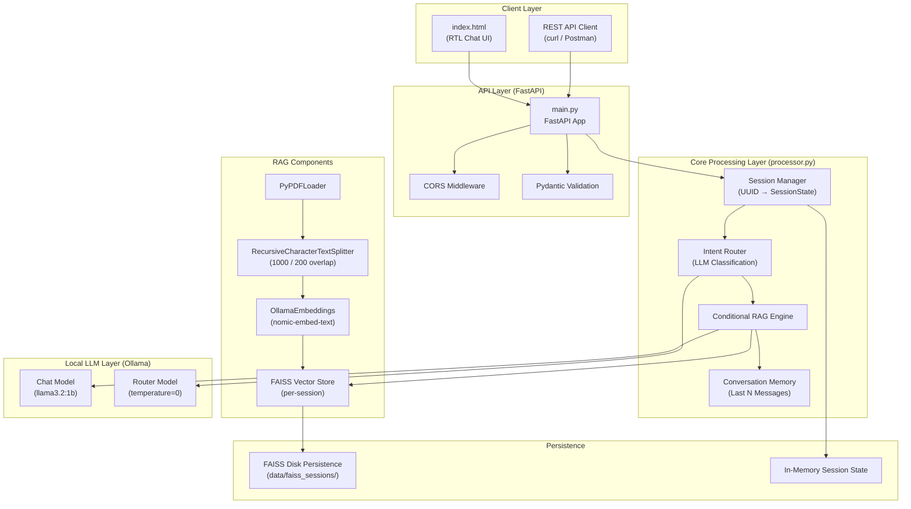
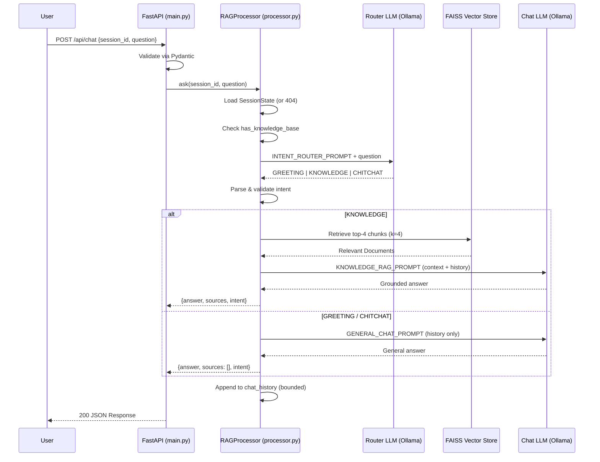
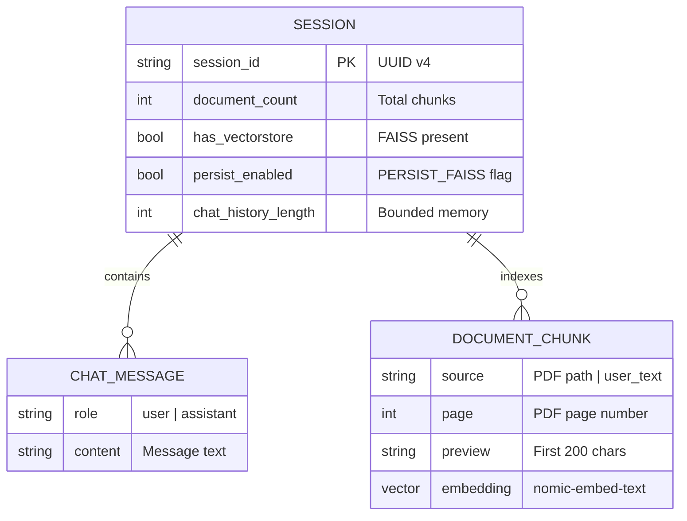
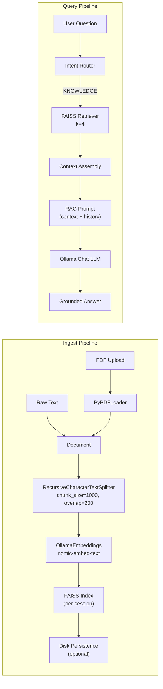
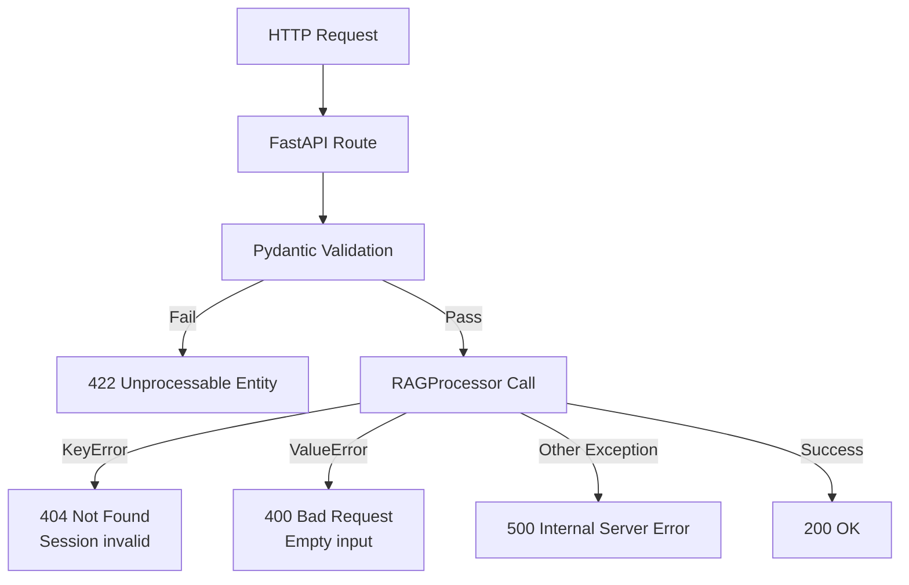

# Branding Bot — Technical Specification & Architecture Document

**Version:** 2.0.0  
**Document Status:** Production-Ready  
**Last Updated:** 2026-08-30  
**Author:** Lead Systems Architect  
**License:** MIT

---

## Table of Contents

1. [System Overview](#1-system-overview)
2. [Architecture & Design](#2-architecture--design)
3. [Database & Data Modeling](#3-database--data-modeling)
4. [API / Interface Reference](#4-api--interface-reference)
5. [Configuration & Environment](#5-configuration--environment)
6. [Deployment & DevOps](#6-deployment--devops)
7. [Security & Error Handling](#7-security--error-handling)

---

## 1. System Overview

### 1.1 Executive Summary

**Branding Bot** is a session-based Retrieval-Augmented Generation (RAG) chatbot with an **LLM-powered intent router**. The system ingests PDF documents or raw text into a per-session vector store (FAISS) and answers user questions grounded in that knowledge — entirely **locally** via Ollama, with no external cloud dependencies.

The core innovation is **conditional RAG**: instead of always querying the vector store (slow, noisy) or never querying it (no grounding), an intent router classifies each user message into one of three categories:

| Intent | Description | Retrieval |
|--------|-------------|-----------|
| `GREETING` | Salutations, thanks, goodbyes | ❌ No FAISS lookup |
| `KNOWLEDGE` | Business/product/policy questions | ✅ FAISS retrieval + RAG |
| `CHITCHAT` | General small talk, meta questions | ❌ No FAISS lookup |

### 1.2 Scope

**In Scope:**
- Session-based chat with isolated FAISS vector stores
- PDF and raw-text ingestion with recursive chunking
- Intent classification (GREETING / KNOWLEDGE / CHITCHAT)
- Conditional RAG with source previews
- Conversation memory (last N messages)
- REST API (FastAPI) + bundled RTL chat UI
- Optional FAISS disk persistence

**Out of Scope (v2.0):**
- Multi-user authentication / RBAC
- Horizontal scaling / distributed vector stores
- Streaming responses (SSE/WebSocket)
- Cloud LLM providers (OpenAI, Anthropic, etc.)

### 1.3 Technical Objectives

| Objective | Metric | Target |
|-----------|--------|--------|
| **Latency** | Time-to-first-token (non-RAG) | < 2s on local hardware |
| **Retrieval Precision** | Top-4 chunk relevance | ≥ 80% for KNOWLEDGE intents |
| **Router Accuracy** | Correct intent classification | ≥ 95% |
| **Session Isolation** | Cross-session data leakage | 0% |
| **Memory Bound** | Max history messages per session | Configurable (default 10) |
| **Uptime** | API availability | ≥ 99.9% (single-node) |

### 1.4 Stakeholders

| Stakeholder | Interest |
|-------------|----------|
| **End Users** | Chat with company knowledge base |
| **Business Owners** | Grounded answers on products/policies |
| **DevOps** | Local-first deployment, minimal infra |
| **Security Team** | No data leaves the host (privacy) |

---

## 2. Architecture & Design

### 2.1 High-Level Architecture



### 2.2 Request Lifecycle (Sequence Diagram)



### 2.3 Directory / Folder Structure

```
Branding-Bot/
│
├── main.py                      # FastAPI application layer (API routes, CORS, validation)
├── processor.py                 # Core RAG engine (session mgmt, intent router, FAISS, prompts)
├── index.html                   # Single-page RTL chat UI (served at /)
├── requirements.txt             # Python dependencies
├── readme.md                    # Project documentation
├── .gitignore                   # Git ignore rules
├── .env                         # Environment variables (gitignored, not committed)
│
├── data/                        # Runtime data (created on demand)
│   └── faiss_sessions/          # Persisted FAISS indexes (when PERSIST_FAISS=true)
│       └── {session_id}/        # One directory per session
│           ├── index.faiss      # FAISS index file
│           └── index.pkl        # FAISS metadata pickle
│
├── static/                      # Optional static assets (mounted if exists)
│   └── (css/js/images)
│
├── docs/                        # Documentation (screenshots, guides)
│   └── screenshot-chat.png      # (optional) UI screenshot
│
├── tests/                       # (recommended) Unit & integration tests
│   ├── test_router.py
│   ├── test_ingest.py
│   └── test_api.py
│
├── docker/                      # (recommended) Docker assets
│   ├── Dockerfile
│   └── docker-compose.yml
│
└── .github/                     # (recommended) CI/CD
    └── workflows/
        └── ci.yml               # GitHub Actions pipeline
```

### 2.4 Architectural Layers

| Layer | Component | Responsibility |
|-------|-----------|----------------|
| **Presentation** | `index.html` | RTL chat interface, session ID in localStorage |
| **API** | `main.py` | HTTP routing, CORS, Pydantic validation, error mapping |
| **Application** | `processor.py` → `RAGProcessor` | Session lifecycle, intent routing, conditional RAG |
| **Domain** | `SessionState`, `ChatMessage` | Session isolation, chat memory, metadata |
| **Infrastructure** | FAISS, Ollama, PyPDFLoader | Vector storage, LLM inference, document parsing |

### 2.5 Design Patterns

| Pattern | Application |
|---------|-------------|
| **Singleton** | `rag_processor = RAGProcessor()` — single shared instance |
| **Lazy Initialization** | Embeddings/LLM models created on first use (properties) |
| **Strategy** | Intent-based routing (GREETING/CHITCHAT vs KNOWLEDGE paths) |
| **Repository** | `_sessions` dict acts as in-memory session repository |
| **Facade** | `RAGProcessor` exposes a clean API over LangChain/FAISS/Ollama |
| **DTO** | Pydantic models (`ChatRequest`, `ChatResponse`, etc.) |

---

## 3. Database & Data Modeling

### 3.1 Data Architecture Overview

The system uses **no traditional SQL/NoSQL database**. Instead, it uses:

1. **In-Memory Session Registry** — a Python `dict[str, SessionState]` mapping UUID → session state.
2. **FAISS Vector Store** — per-session approximate nearest-neighbor index for embeddings.
3. **Optional Disk Persistence** — FAISS indexes serialized to `data/faiss_sessions/{session_id}/`.

### 3.2 Entity-Relationship Overview



### 3.3 Data Flow (Ingest → Query)



### 3.4 Schema Breakdown

#### 3.4.1 `SessionState` (In-Memory Dataclass)

| Field | Type | Description | Constraints |
|-------|------|-------------|-------------|
| `session_id` | `str` | UUID v4 identifier | Required, unique, immutable |
| `vectorstore` | `FAISS \| None` | Per-session FAISS index | Lazy-loaded; `None` until first ingest |
| `document_count` | `int` | Total chunks indexed | `>= 0`; incremented on each ingest |
| `chat_history` | `list[ChatMessage]` | Bounded conversation memory | Max `MAX_HISTORY_MESSAGES` (default 10) |
| `metadata` | `dict[str, Any]` | Extensible session metadata | Optional; reserved for future use |

#### 3.4.2 `ChatMessage` (In-Memory Dataclass)

| Field | Type | Description | Constraints |
|-------|------|-------------|-------------|
| `role` | `Literal["user", "assistant"]` | Message sender | Must be one of the two literals |
| `content` | `str` | Message text | Non-empty |

#### 3.4.3 FAISS Index (Persisted / In-Memory)

| Field | Type | Description | Constraints |
|-------|------|-------------|-------------|
| `index.faiss` | Binary | FAISS vector index | Created on first ingest |
| `index.pkl` | Pickle | Metadata + document store | Serialized with `save_local()` |
| `embedding_dim` | `int` | Vector dimensionality | Determined by `nomic-embed-text` (768) |
| `chunk_size` | `int` | Text chunk length | 1000 chars |
| `chunk_overlap` | `int` | Overlap between chunks | 200 chars |
| `k` | `int` | Retrieval top-k | 4 (hardcoded in `_retrieve_context`) |

#### 3.4.4 Document Metadata (from PyPDFLoader)

| Field | Type | Description | Constraints |
|-------|------|-------------|-------------|
| `source` | `str` | File path or `user_text` | Set by loader or ingest_text |
| `page` | `int \| None` | PDF page number | Present for PDFs; `None` for text |
| `page_content` | `str` | Chunk text | Truncated to 200 chars in previews |

### 3.5 Persistence Strategy

| Mode | `PERSIST_FAISS` | Behavior | Use Case |
|------|-----------------|----------|----------|
| **RAM-only** | `false` (default) | Indexes lost on restart | Development, ephemeral demos |
| **Disk-persisted** | `true` | Indexes saved to `data/faiss_sessions/` | Production, long-lived sessions |

**Persistence lifecycle:**
- **Save:** After every `add_documents()` call → `vectorstore.save_local(path)`
- **Load:** On first access → `FAISS.load_local(path, embeddings, allow_dangerous_deserialization=True)`
- **Delete:** On `DELETE /api/session/{id}` → `shutil.rmtree(path)`

> ⚠️ **Security Note:** `allow_dangerous_deserialization=True` is required by LangChain for local FAISS loading. Only load indexes from trusted sources.

---

## 4. API / Interface Reference

### 4.1 Base URL

```
http://{HOST}:{PORT}
```

Interactive docs (Swagger UI): `http://{HOST}:{PORT}/docs`

### 4.2 Endpoint Summary

| Method | Path | Purpose | Auth |
|--------|------|---------|------|
| `POST` | `/api/session` | Create a new session | None |
| `GET` | `/api/session/{session_id}` | Get session stats | Session ID |
| `DELETE` | `/api/session/{session_id}` | Delete session + disk index | Session ID |
| `POST` | `/api/ingest/pdf` | Upload & index a PDF | Session ID (header) |
| `POST` | `/api/ingest/text` | Ingest raw text | Session ID (header/body) |
| `POST` | `/api/chat` | Ask a question (router + RAG) | Session ID (header/body) |
| `GET` | `/` | Serve chat UI (index.html) | None |

### 4.3 Session ID Resolution

`session_id` can be provided in **two ways** (body takes precedence):

1. **HTTP Header:** `X-Session-ID: <uuid>`
2. **JSON Body:** `{"session_id": "<uuid>"}`

If neither is provided → `400 Bad Request`.

---

### 4.4 Endpoint Details

#### 4.4.1 `POST /api/session` — Create Session

**Request:** No body required.

**Response `200 OK`:**
```json
{
  "session_id": "3f2b8c1e-9a4d-4f6e-8b2a-1c5d7e9f0a3b",
  "message": "Session ایجاد شد. این شناسه را در تمام درخواست‌های بعدی ارسال کنید."
}
```

**Error Codes:**
| Code | Description |
|------|-------------|
| `500` | Server error (unlikely) |

---

#### 4.4.2 `GET /api/session/{session_id}` — Session Stats

**Path Parameter:** `session_id` (string, UUID)

**Response `200 OK`:**
```json
{
  "session_id": "3f2b8c1e-9a4d-4f6e-8b2a-1c5d7e9f0a3b",
  "chunks_indexed": 42,
  "has_vectorstore": true,
  "persist_enabled": false,
  "chat_history_length": 6
}
```

**Error Codes:**
| Code | Description |
|------|-------------|
| `404` | Session not found |
| `500` | Server error |

---

#### 4.4.3 `POST /api/ingest/pdf` — Upload PDF

**Request (multipart/form-data):**
- `file`: PDF file (required, must end with `.pdf`)
- Header: `X-Session-ID: <uuid>` (required)

**Response `200 OK`:**
```json
{
  "message": "PDF با موفقیت پردازش شد.",
  "pages_loaded": 12,
  "chunks_added": 45,
  "total_chunks_in_session": 45
}
```

**Error Codes:**
| Code | Description |
|------|-------------|
| `400` | Missing session_id / non-PDF file / empty file |
| `404` | Session not found |
| `500` | PDF parsing or embedding failure |

---

#### 4.4.4 `POST /api/ingest/text` — Ingest Raw Text

**Request Body:**
```json
{
  "text": "Our support hours are 9–18.",
  "session_id": "3f2b8c1e-9a4d-4f6e-8b2a-1c5d7e9f0a3b"
}
```

**Response `200 OK`:**
```json
{
  "message": "متن با موفقیت پردازش شد.",
  "chunks_added": 1,
  "total_chunks_in_session": 46
}
```

**Error Codes:**
| Code | Description |
|------|-------------|
| `400` | Missing session_id / empty text |
| `404` | Session not found |
| `500` | Embedding failure |

---

#### 4.4.5 `POST /api/chat` — Ask Question

**Request Body:**
```json
{
  "question": "What are your support hours?",
  "session_id": "3f2b8c1e-9a4d-4f6e-8b2a-1c5d7e9f0a3b"
}
```

**Response `200 OK` (KNOWLEDGE intent):**
```json
{
  "answer": "Our support hours are 9:00 to 18:00, Monday through Friday.",
  "sources": [
    {
      "source": "brand-guide.pdf",
      "page": 3,
      "preview": "Support hours: 9–18. Our team is available Monday to Friday..."
    }
  ],
  "intent": "KNOWLEDGE"
}
```

**Response `200 OK` (GREETING/CHITCHAT intent):**
```json
{
  "answer": "Hello! How can I help you today?",
  "sources": [],
  "intent": "GREETING"
}
```

**Error Codes:**
| Code | Description |
|------|-------------|
| `400` | Missing session_id / empty question |
| `404` | Session not found |
| `500` | LLM or retrieval failure |

---

#### 4.4.6 `DELETE /api/session/{session_id}` — Delete Session

**Path Parameter:** `session_id` (string, UUID)

**Response `200 OK`:**
```json
{
  "message": "Session حذف شد."
}
```

**Error Codes:**
| Code | Description |
|------|-------------|
| `500` | Server error (idempotent — no 404) |

---

#### 4.4.7 `GET /` — Serve Chat UI

**Response `200 OK`:** HTML content of `index.html`

**Error Codes:**
| Code | Description |
|------|-------------|
| `404` | `index.html` not found |

---

### 4.5 Pydantic Validation Models

| Model | Fields | Validation |
|-------|--------|------------|
| `TextIngestRequest` | `text: str`, `session_id: str \| None` | `text` min_length=1 |
| `ChatRequest` | `question: str`, `session_id: str \| None` | `question` min_length=1 |
| `ChatResponse` | `answer: str`, `sources: list[dict]`, `intent: str` | `sources` defaults to `[]` |
| `SessionResponse` | `session_id: str`, `message: str` | — |

---

## 5. Configuration & Environment

### 5.1 Environment Variables

All configuration is loaded from `.env` via `python-dotenv` at module import time.

| Variable | Default | Type | Description |
|----------|---------|------|-------------|
| `HOST` | `127.0.0.1` | `str` | Uvicorn bind address |
| `PORT` | `8000` | `int` | Uvicorn bind port |
| `OLLAMA_BASE_URL` | `http://localhost:11434` | `str` | Ollama HTTP API endpoint |
| `OLLAMA_CHAT_MODEL` | `llama3.2:1b` | `str` | Chat + router LLM model name |
| `OLLAMA_EMBEDDING_MODEL` | `nomic-embed-text` | `str` | Embedding model name |
| `OLLAMA_CHAT_TEMPERATURE` | `0.3` | `float` | Generation temperature (0–1) |
| `OLLAMA_ROUTER_TEMPERATURE` | `0` | `float` | Router temperature (deterministic) |
| `MAX_HISTORY_MESSAGES` | `10` | `int` | Max messages kept per session |
| `PERSIST_FAISS` | `false` | `bool` | Persist indexes to disk (`true`/`1`/`yes`) |
| `FAISS_DATA_DIR` | `data/faiss_sessions` | `str` | Directory for persisted indexes |

### 5.2 Hardcoded Constants (Not Configurable)

| Constant | Value | Location |
|----------|-------|----------|
| `CHUNK_SIZE` | `1000` | `processor.py` |
| `CHUNK_OVERLAP` | `200` | `processor.py` |
| `RETRIEVAL_K` | `4` | `processor.py` (`_retrieve_context`) |
| `SOURCE_PREVIEW_LENGTH` | `200` | `processor.py` (`_docs_to_sources`) |
| `VALID_INTENTS` | `{GREETING, KNOWLEDGE, CHITCHAT}` | `processor.py` |

### 5.3 Example `.env` File

```env
# Server
HOST=127.0.0.1
PORT=8000

# Ollama
OLLAMA_BASE_URL=http://localhost:11434
OLLAMA_CHAT_MODEL=llama3.2:1b
OLLAMA_EMBEDDING_MODEL=nomic-embed-text
OLLAMA_CHAT_TEMPERATURE=0.3
OLLAMA_ROUTER_TEMPERATURE=0

# Memory
MAX_HISTORY_MESSAGES=10

# FAISS
PERSIST_FAISS=false
FAISS_DATA_DIR=data/faiss_sessions
```

### 5.4 Production Configuration Recommendations

| Setting | Dev | Production |
|---------|-----|------------|
| `HOST` | `127.0.0.1` | `0.0.0.0` (behind reverse proxy) |
| `PORT` | `8000` | `8000` (internal) |
| `PERSIST_FAISS` | `false` | `true` |
| `FAISS_DATA_DIR` | `data/faiss_sessions` | `/var/lib/branding-bot/faiss` (mounted volume) |
| `MAX_HISTORY_MESSAGES` | `10` | `20` (tune for context window) |
| `OLLAMA_CHAT_TEMPERATURE` | `0.3` | `0.2` (more deterministic) |
| `OLLAMA_ROUTER_TEMPERATURE` | `0` | `0` (always deterministic) |

---

## 6. Deployment & DevOps

### 6.1 Prerequisites

- **Python 3.10+**
- **Ollama** running locally (default `http://localhost:11434`)
- Pulled models:
  ```bash
  ollama pull llama3.2:1b
  ollama pull nomic-embed-text
  ```

### 6.2 Local Development Setup

```bash
# 1. Clone & enter
git clone https://github.com/WhileTrue0087/BrandingAgent.git
cd Branding-Bot

# 2. Create virtual environment
python -m venv .venv

# Windows (PowerShell)
.\.venv\Scripts\Activate.ps1
# macOS / Linux
source .venv/bin/activate

# 3. Install dependencies
pip install -r requirements.txt

# 4. Configure environment
cp .env.example .env   # (or create manually)

# 5. Start Ollama (separate terminal)
ollama serve

# 6. Run the app
python main.py
```

### 6.3 Docker Containerization

#### 6.3.1 `Dockerfile`

```dockerfile
FROM python:3.11-slim

WORKDIR /app

# System dependencies
RUN apt-get update && apt-get install -y --no-install-recommends \
    build-essential \
    && rm -rf /var/lib/apt/lists/*

# Python dependencies
COPY requirements.txt .
RUN pip install --no-cache-dir -r requirements.txt

# Application code
COPY main.py .
COPY processor.py .
COPY index.html .
COPY .env .env

# Runtime data directory
RUN mkdir -p /app/data/faiss_sessions

# Expose API port
EXPOSE 8000

# Health check
HEALTHCHECK --interval=30s --timeout=5s --start-period=10s --retries=3 \
  CMD curl -f http://localhost:8000/ || exit 1

# Run with uvicorn (no reload in production)
CMD ["uvicorn", "main:app", "--host", "0.0.0.0", "--port", "8000"]
```

#### 6.3.2 `docker-compose.yml`

```yaml
version: "3.9"

services:
  ollama:
    image: ollama/ollama:latest
    container_name: ollama
    ports:
      - "11434:11434"
    volumes:
      - ollama_data:/root/.ollama
    restart: unless-stopped

  branding-bot:
    build: .
    container_name: branding-bot
    ports:
      - "8000:8000"
    environment:
      - HOST=0.0.0.0
      - PORT=8000
      - OLLAMA_BASE_URL=http://ollama:11434
      - OLLAMA_CHAT_MODEL=llama3.2:1b
      - OLLAMA_EMBEDDING_MODEL=nomic-embed-text
      - PERSIST_FAISS=true
      - FAISS_DATA_DIR=/app/data/faiss_sessions
    volumes:
      - faiss_data:/app/data/faiss_sessions
    depends_on:
      - ollama
    restart: unless-stopped

volumes:
  ollama_data:
  faiss_data:
```

#### 6.3.3 Build & Run

```bash
# Build
docker build -t branding-bot:2.0.0 .

# Run with compose
docker compose up -d

# Pull models into Ollama container
docker exec ollama ollama pull llama3.2:1b
docker exec ollama ollama pull nomic-embed-text

# Verify
curl http://localhost:8000/api/session
```

### 6.4 CI/CD Pipeline (GitHub Actions)

#### 6.4.1 `.github/workflows/ci.yml`

```yaml
name: CI/CD

on:
  push:
    branches: [main, develop]
  pull_request:
    branches: [main]

jobs:
  test:
    runs-on: ubuntu-latest
    steps:
      - uses: actions/checkout@v4

      - uses: actions/setup-python@v5
        with:
          python-version: "3.11"

      - name: Install dependencies
        run: |
          pip install -r requirements.txt
          pip install pytest httpx

      - name: Run tests
        run: pytest tests/ -v

      - name: Lint
        run: |
          pip install ruff
          ruff check main.py processor.py

  build:
    needs: test
    runs-on: ubuntu-latest
    if: github.ref == 'refs/heads/main'
    steps:
      - uses: actions/checkout@v4

      - name: Build Docker image
        run: docker build -t ${{ secrets.REGISTRY }}/branding-bot:${{ github.sha }} .

      - name: Push to registry
        run: |
          echo "${{ secrets.REGISTRY_PASSWORD }}" | docker login ${{ secrets.REGISTRY }} -u ${{ secrets.REGISTRY_USERNAME }} --password-stdin
          docker push ${{ secrets.REGISTRY }}/branding-bot:${{ github.sha }}

  deploy:
    needs: build
    runs-on: ubuntu-latest
    if: github.ref == 'refs/heads/main'
    steps:
      - name: Deploy to server
        uses: appleboy/ssh-action@v1.0.3
        with:
          host: ${{ secrets.SERVER_HOST }}
          username: ${{ secrets.SERVER_USER }}
          key: ${{ secrets.SSH_KEY }}
          script: |
            cd /opt/branding-bot
            docker compose pull
            docker compose up -d --force-recreate
            docker system prune -f
```

### 6.5 Production Server Setup (Single Node)

```bash
# 1. Install Docker & Docker Compose
curl -fsSL https://get.docker.com | sh

# 2. Install Ollama
curl -fsSL https://ollama.com/install.sh | sh

# 3. Pull models
ollama pull llama3.2:1b
ollama pull nomic-embed-text

# 4. Clone project
git clone https://github.com/WhileTrue0087/BrandingAgent.git /opt/branding-bot
cd /opt/branding-bot

# 5. Create .env
cat > .env << 'EOF'
HOST=0.0.0.0
PORT=8000
OLLAMA_BASE_URL=http://localhost:11434
OLLAMA_CHAT_MODEL=llama3.2:1b
OLLAMA_EMBEDDING_MODEL=nomic-embed-text
OLLAMA_CHAT_TEMPERATURE=0.3
OLLAMA_ROUTER_TEMPERATURE=0
MAX_HISTORY_MESSAGES=10
PERSIST_FAISS=true
FAISS_DATA_DIR=/opt/branding-bot/data/faiss_sessions
EOF

# 6. Run with systemd (or Docker)
# Option A: systemd service
cat > /etc/systemd/system/branding-bot.service << 'EOF'
[Unit]
Description=Branding Bot RAG Chatbot
After=network.target

[Service]
Type=simple
WorkingDirectory=/opt/branding-bot
ExecStart=/opt/branding-bot/.venv/bin/uvicorn main:app --host 0.0.0.0 --port 8000
Restart=always
RestartSec=5
EnvironmentFile=/opt/branding-bot/.env

[Install]
WantedBy=multi-user.target
EOF

systemctl daemon-reload
systemctl enable branding-bot
systemctl start branding-bot

# 7. Reverse proxy (Nginx)
cat > /etc/nginx/sites-available/branding-bot << 'EOF'
server {
    listen 80;
    server_name bot.example.com;

    location / {
        proxy_pass http://127.0.0.1:8000;
        proxy_set_header Host $host;
        proxy_set_header X-Real-IP $remote_addr;
        proxy_set_header X-Forwarded-For $proxy_add_x_forwarded_for;
        proxy_set_header X-Forwarded-Proto $scheme;
    }
}
EOF

ln -s /etc/nginx/sites-available/branding-bot /etc/nginx/sites-enabled/
nginx -t && systemctl reload nginx
```

### 6.6 Scaling Considerations

| Scenario | Strategy |
|----------|----------|
| **Multiple users** | Session isolation already handles this; add API rate limiting |
| **High concurrency** | Run multiple uvicorn workers (`--workers 4`) |
| **Large knowledge base** | Increase `CHUNK_SIZE`; consider HNSW index params |
| **Multi-node** | Replace in-memory sessions with Redis; FAISS → Qdrant/Weaviate |
| **GPU acceleration** | Use `faiss-gpu`; Ollama with CUDA |

---

## 7. Security & Error Handling

### 7.1 Authentication Strategy

**Current (v2.0):** No authentication. Session IDs act as bearer tokens.

| Risk | Mitigation |
|------|------------|
| Session ID guessing | UUID v4 (122 bits entropy) — practically unguessable |
| Session hijacking | Use HTTPS in production; never log session IDs |
| Cross-session access | Each session has isolated FAISS + history |

**Recommended (v3.0):**
- API key / JWT authentication
- Rate limiting (e.g., `slowapi`)
- Session TTL / expiry
- Admin endpoints for session management

### 7.2 Security Best Practices Applied

| Practice | Implementation |
|----------|----------------|
| **Input Validation** | Pydantic models with `min_length=1` on all text fields |
| **File Type Validation** | PDF extension check + non-empty content check |
| **Path Traversal** | Session IDs are UUIDs; FAISS paths derived from UUIDs only |
| **CORS** | `allow_origins=["*"]` — **dev only**; restrict in production |
| **Dependency Pinning** | `requirements.txt` uses `>=` — pin exact versions in production |
| **Secrets Management** | `.env` is gitignored; never commit credentials |
| **Deserialization** | `allow_dangerous_deserialization=True` — only load trusted FAISS indexes |
| **Temp File Cleanup** | `NamedTemporaryFile` deleted in `finally` block |
| **Error Sanitization** | `_handle_processor_error` maps exceptions to safe HTTP responses |

### 7.3 CORS Configuration

**Current (dev):**
```python
app.add_middleware(
    CORSMiddleware,
    allow_origins=["*"],
    allow_credentials=True,
    allow_methods=["*"],
    allow_headers=["*"],
)
```

**Production (recommended):**
```python
app.add_middleware(
    CORSMiddleware,
    allow_origins=[
        "https://bot.example.com",
        "https://admin.example.com",
    ],
    allow_credentials=True,
    allow_methods=["GET", "POST", "DELETE"],
    allow_headers=["Content-Type", "X-Session-ID"],
)
```

### 7.4 Error Handling Strategy



**Error Mapping Table:**

| Exception | HTTP Status | Message |
|-----------|-------------|---------|
| `KeyError` | `404` | Session not found |
| `ValueError` | `400` | Empty/invalid input |
| `HTTPException` (raised in route) | `400` | Missing session_id, non-PDF, empty file |
| Any other `Exception` | `500` | Generic server error |

### 7.5 Troubleshooting / FAQ

#### Q1: `ConnectionError: Failed to connect to Ollama`

**Cause:** Ollama is not running or `OLLAMA_BASE_URL` is wrong.

**Fix:**
```bash
# Start Ollama
ollama serve

# Verify
curl http://localhost:11434/api/tags
```

#### Q2: `ModelNotFoundError: llama3.2:1b not found`

**Cause:** Model not pulled.

**Fix:**
```bash
ollama pull llama3.2:1b
ollama pull nomic-embed-text
```

#### Q3: `Session نامعتبر است: <uuid>`

**Cause:** Session ID is invalid or expired (server restarted with `PERSIST_FAISS=false`).

**Fix:**
- Create a new session: `POST /api/session`
- Enable `PERSIST_FAISS=true` for persistence across restarts

#### Q4: PDF upload returns `400: فقط فایل PDF پذیرفته می‌شود`

**Cause:** File extension is not `.pdf` or file is empty.

**Fix:** Ensure the file has a `.pdf` extension and non-zero size.

#### Q5: Chat returns empty or generic answers for KNOWLEDGE questions

**Cause:** No documents ingested, or retrieval returned no relevant chunks.

**Fix:**
- Ingest documents first: `POST /api/ingest/pdf` or `/api/ingest/text`
- Check `GET /api/session/{id}` → `chunks_indexed > 0`
- Consider lowering `CHUNK_SIZE` for more granular retrieval

#### Q6: High latency on first request

**Cause:** Lazy initialization of embeddings/LLM models.

**Fix:** Pre-warm by making a dummy request at startup, or use a warmup script.

#### Q7: `allow_dangerous_deserialization` warning

**Cause:** LangChain security warning for FAISS `load_local`.

**Fix:** Only load indexes from trusted sources. In production, consider a signed/checksummed index store.

#### Q8: Memory grows unboundedly

**Cause:** Many sessions created without deletion.

**Fix:**
- Implement session TTL / cleanup job
- Call `DELETE /api/session/{id}` when done
- Monitor `_sessions` dict size

#### Q9: CORS errors in browser

**Cause:** Frontend on different origin than API.

**Fix:** Update `allow_origins` in `main.py` to include the frontend origin.

#### Q10: `ModuleNotFoundError: langchain_community`

**Cause:** Dependencies not installed.

**Fix:**
```bash
pip install -r requirements.txt
```

---

## Appendix A: Dependencies

| Package | Version | Purpose |
|---------|---------|---------|
| `fastapi` | `>=0.115.0` | Web framework |
| `uvicorn[standard]` | `>=0.32.0` | ASGI server |
| `python-multipart` | `>=0.0.12` | File upload support |
| `python-dotenv` | `>=1.0.0` | Environment loading |
| `langchain` | `>=0.3.0` | RAG orchestration |
| `langchain-classic` | `>=1.0.0` | Legacy LangChain components |
| `langchain-core` | `>=0.3.0` | Core abstractions |
| `langchain-community` | `>=0.3.0` | Community integrations (FAISS, Ollama) |
| `langchain-text-splitters` | `>=0.3.0` | Text chunking |
| `faiss-cpu` | `>=1.9.0` | Vector similarity search |
| `pypdf` | `>=5.0.0` | PDF parsing |

## Appendix B: Prompt Templates

### B.1 Intent Router Prompt

```
تو یک مسیریاب intent هستی. پیام کاربر را دقیقاً به یکی از سه دسته زیر تقسیم کن:

GREETING — سلام، احوالپرسی، تشکر، خداحافظی، خوش‌آمدگویی
KNOWLEDGE — سوالات مربوط به کسب‌وکار، قیمت‌ها، خدمات، محصولات، سیاست‌ها، یا محتوای PDF/متن بارگذاری‌شده
CHITCHAT — سوالات عمومی، متفرقه یا شخصی درباره ربات (مثل «تو کی هستی؟»، «هوا چطوره؟»، «چطوری؟»)

قوانین سخت:
- فقط و فقط یکی از این سه کلمه را برگردان: GREETING یا KNOWLEDGE یا CHITCHAT
- هیچ توضیح، جمله یا علامت اضافه‌ای ننویس

پیام کاربر:
{question}

خروجی:
```

### B.2 General Chat Prompt (GREETING / CHITCHAT)

```
تو یک دستیار هوشمند و صمیمی هستی. به احوالپرسی و گفتگوی عمومی به زبان طبیعی و دوستانه پاسخ بده.
اگر کاربر درباره جزئیات تخصصی کسب‌وکار پرسید، مودبانه بگو برای آن سوالات از اطلاعات شرکت کمک می‌گیری.

{history}

سوال کاربر:
{question}

پاسخ (به زبان همان سوال):
```

### B.3 Knowledge RAG Prompt (KNOWLEDGE)

```
تو دستیار هوشمند شرکت هستی. با توجه به اطلاعات دیتابیس [Context] به سوال کاربر پاسخ بده.
اگر پاسخ در متن نبود، با تکیه بر دانش خودت راهنمایی کن اما اشاره کن که اطلاعات دقیق در سند ثبت نشده است.

{history}

اطلاعات دیتابیس (Context):
{context}

سوال کاربر:
{question}

پاسخ (به زبان همان سوال):
```

---

## Appendix C: Changelog

| Version | Date | Changes |
|---------|------|---------|
| 2.0.0 | 2026-08-30 | Intent router, conditional RAG, session isolation, FAISS persistence |
| 1.0.0 | — | Initial release (basic RAG chatbot) |

---

*End of Document — Branding Bot Technical Specification v2.0.0*